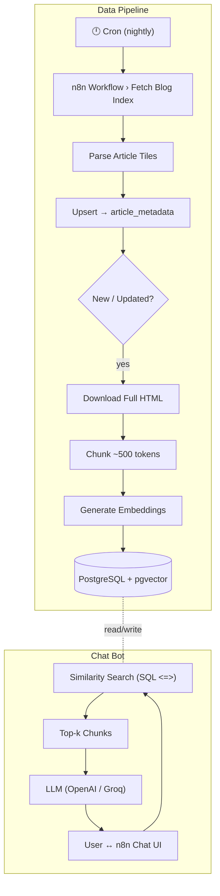

# Bitovi Blog Agent

A self‑hosted **Retrieval‑Augmented‑Generation (RAG)** service that turns the entire Bitovi blog into a query‑ready knowledge base.  The agent ingests every post, stores both the metadata _and_ dense embeddings in PostgreSQL + pgvector, and exposes an API that ElizaOS (or any LLM framework) can call to answer questions with fresh, source‑grounded facts.

---

## Table of Contents
1. [Use Case](<use-case>)
2. [Tech stack](<tech-stack>)
3. [Architecture](#architecture)
4. [Getting started](<getting-started>)
5. [Workflows](#workflows)
6. [Schema](#schema)
7. [Troubleshooting](#troubleshooting)
8. [Roadmap](#roadmap)
9. [License](#license)

---

## Use Case
- **Instant answers:** Users can query "Which articles cover feature flags?" in seconds instead of searching the site.
- **Grounded‑only:** Responses always cite the source URL and paragraph.
- **Incremental:** The nightly crawler adds only new or changed posts—no full re‑index required.

---

## Tech stack
| Layer | Tooling |
|-------|---------|
| Scraping & Orchestration | **n8n** (HTTP Request → HTML Extract → Function) |
| Storage | **PostgreSQL 13** with `pgvector` 0.7.0 |
| Embeddings | OpenAI `text-embedding-3-small` (configurable) |
| RAG / API | **ElizaOS** custom agent route (`/ask`) |
| Containerisation | **Docker Compose** |
| Admin UI | Adminer 4.x |

---

## Architecture



---

## Getting Started
```bash
git clone https://github.com/AndreF343/N8N-Agentic-Workflow.git
cd N8N-Agentic-Workflow
docker compose up --build
# Editor is now accessible via:
https://localhost:5678/
```
The stack brings up:
- `postgres:13` with `pgvector`
- `n8n:latest` on port 5678
- `adminer` on port 8080

### Environment variables
| Key | Purpose |
|-----|---------|
| `POSTGRES_USER` / `POSTGRES_PASSWORD` | DB auth |
| `OPENAI_API_KEY` | For embeddings & chat (optional if using Groq) |
| `LLM_PROVIDER` | `openai` \| `groq` |
| `BITOVI_BLOG_URL` | Defaults to `https://bitovi.com/blog` |

---

## Workflows
### 1 · `Fetch Article Metadata`
1. Hit the blog index page(s).
2. Extract title, author, date, link.
3. UPSERT into `article_metadata`.

### 2 · `Fetch Article Content`
1. For each new link, download HTML.
2. Strip boilerplate, split into ~500‑token chunks.
3. Insert into `article_chunks` with `vector_created=false`.

### 3 · `Generate Embeddings`
1. Select chunks where `vector_created=false`.
2. Call embedding API.
3. Write vector to `chunk_embedding` column, set flag `true`.

### 4 · `Ask Agent`
1. Front‑end sends `/ask?q=...` to ElizaOS.
2. API runs similarity search (`ORDER BY embedding <=> :query_vec LIMIT k`).
3. LLM receives the top chunks as context.

---

## Schema
```sql
-- article_metadata
id            serial primary key,
title         text,
author        text,
article_link  text unique,
date          date,
vector_created boolean default false

-- article_chunks
id            serial primary key,
article_id    int references article_metadata(id),
chunk_index   int,
chunk_text    text,
embedding     vector(1536)
```

---

## Troubleshooting
| Issue | Remedy |
|-------|--------|
| `ERROR: extension "pgvector" does not exist` | `CREATE EXTENSION pgvector;` as superuser |
| Empty answers | Check that `vector_created=true` rows exist |
| Blog markup changed | Update CSS selectors in `Fetch Article Content` node |

---

## Roadmap
- [ ] Automatic selector discovery via Readability
- [ ] Switch to **Qdrant** for ANN search benchmarking
- [ ] Web UI with chat history & source highlighting
- [ ] GitHub Action to publish a Docker image

---

## License
MIT © 2025 Andre Foote

